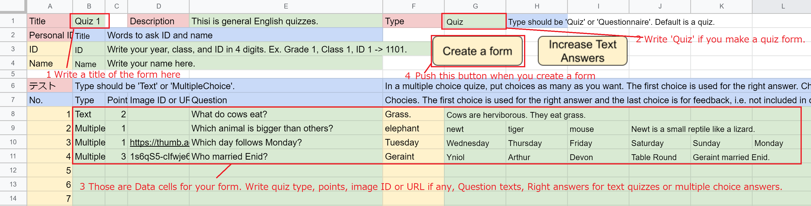
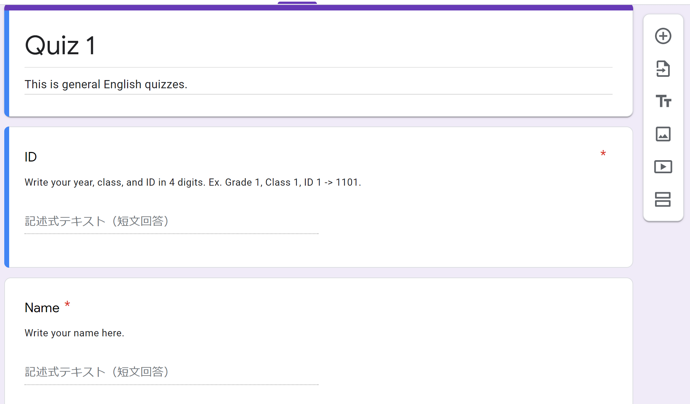
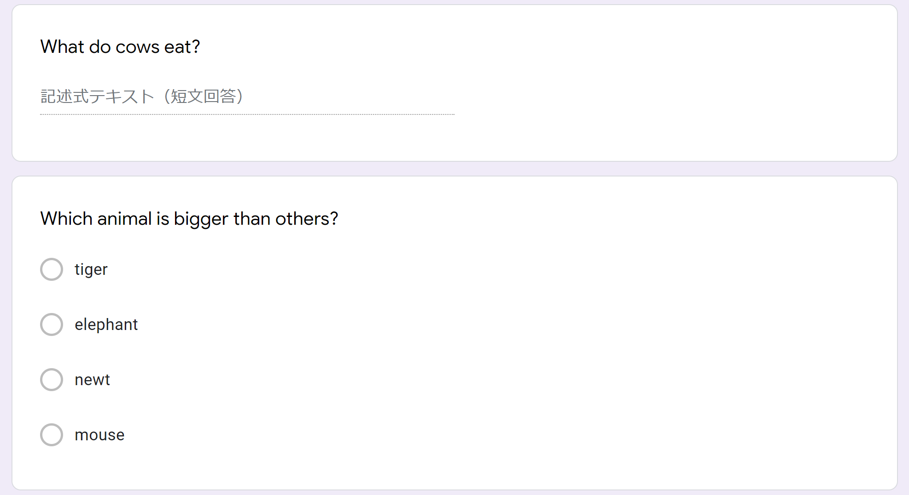
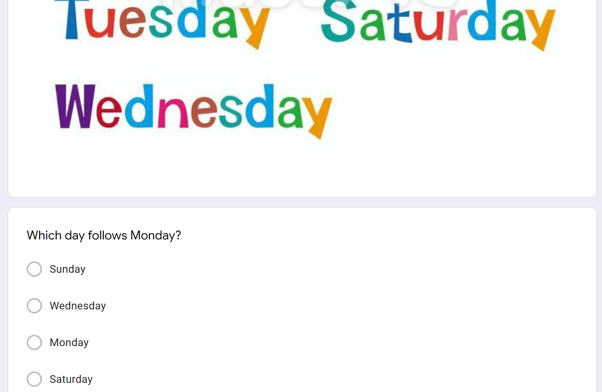
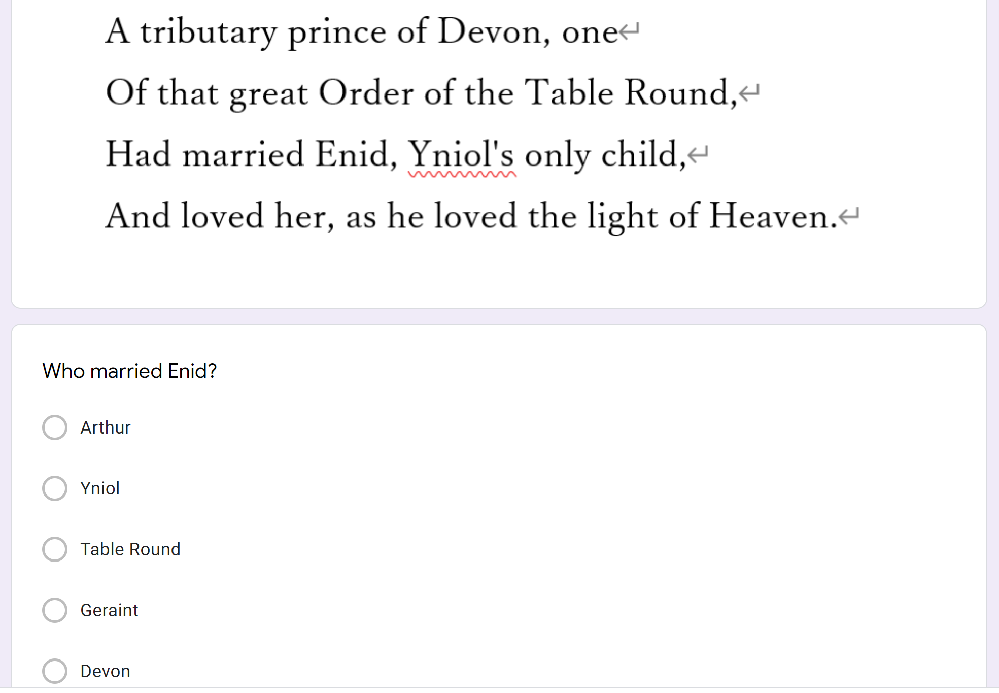

# create_quizzes 
This spreadsheet allows you to create a quiz-type form on your Google Drive. 
 
You can download the spreadsheet from the links below. Open and save a copy on your google drive: 
&nbsp;&nbsp;&nbsp;&nbsp;English version: <a href="https://docs.google.com/spreadsheets/d/1EjzVI4ImwuBrnGxZ4xWEb_SSoBfdjx3xNjRnM3FlhtA">here</a> 
&nbsp;&nbsp;&nbsp;&nbsp;Japanese version: <a href="https://docs.google.com/spreadsheets/d/1hfwj8xEK2TOL2FeUAUIKWmVyVuiLSLBBeY_IcIn4WpM">here</a> 
 
The concept is to have the teacher concentrate on creating quizzes only. The teacher only write quiz contents and push button. 
Use a Google Chrome webbrowser, opening the spreadsheet file from Google Drive. When you create a form, the quiz form will be put on 'My Drive' (root) folder on your Google Drive.  
 
The spreadsheet is consisted of the cells as below: 
 
Try filling in the cells following those steps: 
&nbsp;&nbsp;1. Write you quiz(form) title on B1 cell, or you can write it on the sheet title. You can also write quiz description("E1"), and student ID questionnaire below. 
&nbsp;&nbsp;2. Write 'Quiz' on the form type cell (G1). If you set Quiz, the form will be a quiz form. Otherwize, the form will be a ordinary questionnaire, with unnecessary data for a questionnaire ignored. 
&nbsp;&nbsp;3. Write quiz contents on row 8 or later cells. Each cell has the rule as below: 
&nbsp;&nbsp;&nbsp;&nbsp;&nbsp;a) Quiz Type (column B): Type should be 'Text' or 'MultipleChoice'. If the type is Text, students type their answer. If MultipleChoice, students choose one of the choices. 
&nbsp;&nbsp;&nbsp;&nbsp;&nbsp;b) Quiz Scoring Points (column C): This means how many points students can get in the quiz form when they choose correct answer. 
&nbsp;&nbsp;&nbsp;&nbsp;&nbsp;c) Image ID or URL (column D): If you want to put image, write image ID on your Google Drive or URL of the image file, ending the url with png, jpg, or etc. 
  &nbsp;&nbsp;&nbsp;&nbsp;&nbsp;&nbsp;&nbsp;&nbsp;Note: To get image ID, open your Google Drive, right click the image file, and click 'get the link.' Then copy the link and cut the ID. FOr example, if your image link is 'https://drive.google.com/file/d/1s6qS5-cIfwje6DhlBpsh5A0hTGXcD-di/view?usp=sharing', then ID is '1s6qS5-cIfwje6DhlBpsh5A0hTGXcD-di'. 
&nbsp;&nbsp;&nbsp;&nbsp;&nbsp;d) Question Text (column E): Write the question text here. 
&nbsp;&nbsp;&nbsp;&nbsp;&nbsp;e) Choices or Answers (column F or later): In a multiple choice quize, put choices as many as you want. The first choice is used for the right answer. Choices will be shuffled. The last choice is used for feedback, both for the correct answer and wrong answers. In a Text quiz, put right answers. Remember those answers are not set in the form due to the current Google App Script issue. Instead, you can use 'Increase Text Answers' button to increase answers, i.e. putting currently lower and upper capital letters and final periods. The last answer is used for feedback. 
&nbsp;&nbsp;4. Push the 'Create a Form' button. You can get a quiz form on 'My Drive' (root) folder on your Google Drive. If you push the 'Increase Text Answers' button, it increases answers in the Text type quiz row, i.e. putting currently lower and upper capital letters and final periods. 
 
The example of the created form is as follows: 
 This is the top part of the form. You can see the title of the quiz and students personal ID questionnaires. 
 This is a Text type quiz and a Multiple Choice quiz. Choices are shuffled. 
 If you set image URL, the image will be shown above the quiz. 
 If you set image ID, the image will be shown above the quiz as well. 
  

